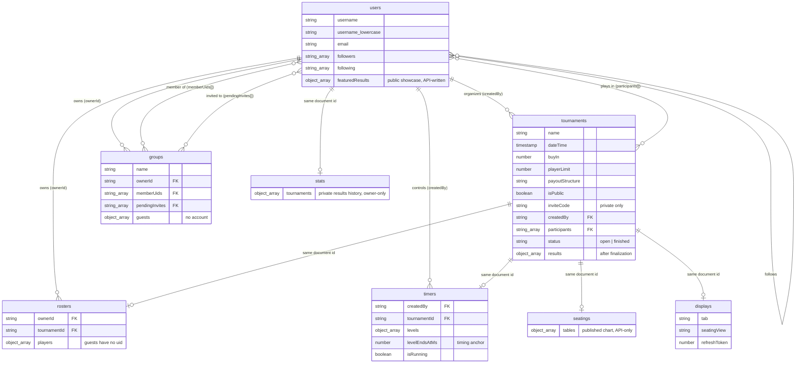

# PokerPal API

The REST service behind PokerPal, shared by both clients.

```
Flutter Android ─┐
                 ├── HTTPS / REST / JSON → Firebase Cloud Functions → Firestore
React Web ───────┘                         (Express + TypeScript,
                                            Firebase Admin SDK)

Firebase Authentication supplies ID tokens used by both clients.
```

## Contents

- [Architecture](#architecture)
- [Authentication](#authentication)
- [Authorization](#authorization)
- [Errors](#errors)
- [Endpoints](#endpoints)
- [Data model](#data-model)
- [What still talks to Firestore directly](#what-still-talks-to-firestore-directly)
- [Which operations both clients use](#which-operations-both-clients-use)
- [Running it](#running-it)

## Architecture

Three repositories against one Firebase project (`pokerpal-a1451`):

| Repo | Role |
|---|---|
| [`poker_pal`](../poker_pal) | Flutter Android client — the full feature set |
| [`poker_pal_web`](../poker_pal_web) | React + Vite + TypeScript client — tournaments, clock display, statistics |
| `poker_pal_api` | This service: Cloud Functions + Express + TypeScript, plus the Firestore security rules |

The whole API is one HTTPS function (`api`) pinned to `us-central1`, with an
Express app behind it:

```
src/
  index.ts                  # the onRequest wrapper
  app.ts                    # express app: CORS allowlist, routers, error handler
  middleware/
    requireAuth.ts          # verifies the Firebase ID token
    errorHandler.ts         # the one place a failure response is produced
  lib/
    errors.ts               # ApiError + helpers
    firestore.ts            # lazily-resolved db handle and conversions
  routes/                   # tournaments, groups, stats, users
  services/                 # the domain logic the routes call
  validation/schemas.ts     # zod schemas
  types/models.ts           # wire shapes
test/                       # vitest
```

**Firebase and Firestore stand in for the Tomcat + MySQL stack the assignment
originally suggested, with the instructor's approval.** Cloud Functions host the
Express application and Firestore is the database; the REST interface, the
validation, the authorization and the error handling are all implemented here in
the usual way.

**One deliberate exception to "everything through REST": the tournament clock.**
The organizer's phone controls it while a laptop or TV shows the same clock in
the room, so a pause or a level change has to appear within a second. That is a
push problem, and both clients subscribe to the `timers` document directly for
it. Every other operation — creating and editing tournaments, joining and
leaving, managing players, finalizing, statistics — goes through the REST
service. Firestore's rules make this more than a convention: clients are denied
write access to `tournaments` outright, so REST is the only path available.

### Why there is a server at all

Two things in this application cannot be done correctly from a client:

1. **Finalizing a tournament.** The security rules let a client write only its
   *own* `users/{uid}` document, so no client can record results into the other
   participants' histories. The Admin SDK can, and does it in one transaction:
   the standings, the status change and every finisher's statistics entry commit
   together or not at all.
2. **Joining a tournament.** The player-limit check and the participant append
   have to be atomic, or two people racing for the last seat can both take it. A
   client-side transaction can only approximate this.

Statistics are a third, softer case: the arithmetic used to exist twice, once in
each client, and could drift. There is now one implementation.

## Authentication

Both clients sign in with Firebase Authentication and send the resulting ID
token:

```
Authorization: Bearer <firebase-id-token>
```

`requireAuth` verifies it and attaches the decoded uid to the request. **That uid
is the only identity the API trusts.** A request body never gets to say who it
is — `createdBy`, `ownerId` and the owner of a statistics entry all come from the
token, so passing someone else's id changes nothing.

Every route requires authentication except `GET /health`.

## Authorization

Authentication answers *who is calling*; these rules answer *what they may do*.
All of them are enforced in the API, because the Admin SDK ignores the Firestore
security rules entirely.

| Rule | Where | Result when violated |
|---|---|---|
| Only the organizer may edit, delete or finalize a tournament, or change its players | `assertOrganizer` compares the stored `createdBy` with the token uid | `403 FORBIDDEN` |
| A private tournament is visible only to its organizer, its participants, or someone presenting its invite code | `assertCanView` | `404 NOT_FOUND`, so an id cannot be probed |
| Joining a private tournament requires the invite code | `assertCanJoin`, re-checked inside the join transaction | `403 FORBIDDEN` |
| The invite code is returned only to the organizer | `forViewer` strips it for everyone else | field simply absent |
| Only a group's owner may rename, delete, invite to it or manage its guests | `assertOwner` in the group service | `403 FORBIDDEN` |
| Only the invited user may accept or decline their own invite | the acting uid comes from the token, and must already be in `pendingInvites` | `409 NO_INVITE` |
| A group member may remove only themselves; the owner may remove anyone | `removeMember` | `403 FORBIDDEN` |
| A player's statistics are readable only by that player | `GET /users/:id/stats` compares the path id with the token uid | `403 FORBIDDEN` |
| Statistics entries are always written to and deleted from the caller's own history | the uid is taken from the token; there is no parameter to point elsewhere | n/a — impossible to express |
| A group is visible only to its owner, members and pending invitees | `assertVisible` | `404 NOT_FOUND`, so membership is not confirmed |
| A featured result can be chosen and renamed, never invented | `PUT /users/me/featured` copies place and winnings from the stored standings; the schema accepts no such fields | forged fields are stripped |
| Only the organizer may publish or clear a seating chart | `assertOrganizer` on the seating routes | `403 FORBIDDEN` |

Two consequences worth stating explicitly:

- **No endpoint accepts an identity from the request.** No schema defines
  `createdBy`, `ownerId` or `userId`, and unknown keys are stripped during
  validation, so a body that tries to declare one is discarded before any
  service sees it.
- **Statistics have no public projection.** `GET /users/:id/stats` serves the
  caller their own history and refuses everyone else. A player's buy-ins,
  rebuys and payouts are private financial data, and nothing in either client
  displays another player's results.

## Errors

Every failure has the same shape:

```json
{
  "error": {
    "code": "INVALID_BUY_IN",
    "message": "Buy-in must be greater than or equal to zero."
  }
}
```

Branch on `code`; show `message`. Unexpected errors are logged server-side and
returned as a bare `500 INTERNAL` — internals are never echoed back.

| Status | When |
|---|---|
| 200 | OK |
| 201 | Created |
| 204 | Done, nothing to return (deletes) |
| 400 | Validation failed, or a domain rule was broken |
| 401 | Missing, malformed or expired token |
| 403 | Signed in, but not allowed (e.g. not the organizer) |
| 404 | No such tournament, group, user or route |
| 409 | State clash: tournament full, already joined, already finalized |
| 500 | Unhandled server error |

Common codes: `UNAUTHENTICATED`, `FORBIDDEN`, `NOT_FOUND`, `VALIDATION_ERROR`,
`ALREADY_JOINED`, `TOURNAMENT_FULL`, `TOURNAMENT_FINISHED`, `ALREADY_FINALIZED`,
`INVALID_PLACEMENTS`, `INVALID_WINNINGS`, `UNKNOWN_PLAYER`, `DUPLICATE_PLAYER`,
`ALREADY_MEMBER`, `ALREADY_INVITED`, `NO_INVITE`, `OWNER_CANNOT_LEAVE`,
`INTERNAL`.

## Endpoints

### Health and identity

#### `GET /health`
Public. → `200 {"ok": true}`

#### `GET /me`
→ `200 {"uid": "...", "email": "..."}` · `401`

#### `GET /users/me`
Current user with profile fields. `followers` and `following` are counts, not
uid lists.
→ `200 {"uid","email","username","photoURL","backgroundURL","followers","following","hasProfile","featuredResults"}` · `401`

#### `POST /users/ensure-profile`
Creates `users/{uid}` if missing; a no-op otherwise. Both clients call this after
sign-up and after a first Google sign-in, so a profile created on web is
identical to one created on mobile.

Body: `{"username": "Ada"}` (optional; falls back to the email's local part)
→ `201 {"created": true, "username": "Ada"}` · `200 {"created": false}` · `401`

#### `GET /users/:id`
The public projection — nothing financial.
→ `200 {"uid","username","photoURL","featuredResults"}` · `401` · `404`

#### `PUT /users/me/featured`
Sets which finished tournaments show on the caller's public profile. The body
carries only tournament ids and optional display names; the server looks each
result up in the real finalized standings and stores
`{tournamentId, name, date, place, winnings}` from there — so a player can
showcase and rename a result they earned, never fabricate one. Items with no
result for the caller are skipped; duplicates are collapsed; at most 12.

Body: `{"items": [{"tournamentId": "...", "name": "My first title"}]}`
→ `200 {"featuredResults": [...]}` · `400` · `401` · `404` (a named tournament
does not exist or is not visible to the caller)

---

### Tournaments

#### `GET /tournaments?filter=mine|registered|public|all|archived`
`mine` = organized by the caller, `registered` = joined by the caller, `public` =
joinable (public, not the caller's own, not already joined), `all` = the union,
`archived` = finished tournaments the caller organized or played in. Finished
tournaments are excluded from every active filter and appear only under
`archived`. Sorted newest first. Organizer names are resolved server-side in one
batched read, and each row carries a roster-derived `guestCount` so player
counts can include guests.

→ `200 {"tournaments": [Tournament & {organizerName, guestCount}]}` · `400` (bad filter) · `401`

#### `POST /tournaments`
`createdBy` comes from the token. `organizerIsPlaying` and `groupMemberUids` seed
the participant list.

```json
{
  "name": "Friday game",
  "dateTime": "2026-09-04T19:00:00.000Z",
  "buyIn": 20,
  "playerLimit": 8,
  "payoutStructure": "standard",
  "isPublic": true,
  "description": "",
  "rules": "",
  "allowRebuys": true,
  "allowAddons": false,
  "lateRegistration": false,
  "organizerIsPlaying": true,
  "groupMemberUids": []
}
```

Validation: non-empty `name`; `buyIn >= 0`; `playerLimit` a whole number 2–100;
`payoutStructure` one of `standard`, `top-heavy`, `flat`, `winner-takes-all`,
`manual`; `manualPayouts` required for `manual`, each 0–100; `dateTime`
parseable.

→ `201 {"tournament": Tournament}` · `400` · `401`

#### `GET /tournaments/:id`
Returns the tournament with the organizer's name and the players list, so
clients do not need a lookup per participant.

A **public** tournament is readable by any signed-in user. A **private** one is
readable by its organizer, its participants, or a caller presenting the invite
code in an `X-Tournament-Code` header — a header rather than the query string so
the code stays out of URLs, logs and referrers. Anyone else gets `404`, because a
tournament id is meant to be unguessable and confirming one exists would itself
disclose something.

`inviteCode` is present in the response **only for the organizer**.

→ `200 {"tournament": TournamentDetail, "players": [Player]}` · `401` · `404`

#### `PUT /tournaments/:id`
Organizer only. Same body as create, minus the seeding fields. `createdBy`,
`createdAt` and `participants` are never rewritten. Omitting `manualPayouts` or
`inviteCode` **deletes** them, which is how "not applicable" has always been
stored.

→ `200 {"tournament": Tournament}` · `400` · `401` · `403` · `404`

#### `DELETE /tournaments/:id`
Organizer only. Deletes the tournament **and its side-car documents** — the
roster, published seating, timer and display-control docs all live under the
tournament's own id and go with it in one atomic batch.
→ `204` · `401` · `403` · `404`

#### `GET /tournaments/by-code/:code`
Resolves an invite code without joining. → `200 {"tournament": Tournament}` · `401` · `404`

#### `POST /tournaments/:id/join`
Transactional: re-reads the tournament, re-checks access, checks the limit,
appends the caller.

A public tournament needs no body. A private one requires its code:

```json
{ "inviteCode": "ABC123" }
```

Sent in the body rather than the URL for the same reason as the header above.
Knowing the id is not enough — without a valid code the answer is `403`. The
organizer and existing participants never need to supply it.

→ `200 {"tournament": Tournament}` · `401` · `403` · `404` ·
`409 ALREADY_JOINED | TOURNAMENT_FULL | TOURNAMENT_FINISHED`

#### `POST /tournaments/:id/leave`
→ `200 {"tournament": Tournament}` · `401` · `404` · `409 TOURNAMENT_FINISHED`

---

### Participants

A tournament's players live in two places: registered users in
`tournaments/{id}.participants`, and guests without an account in
`rosters/{tournamentId}.players`. These endpoints present them as one list.
Guests are addressed by a `guest:<name>` id, registered players by their uid.

#### `GET /tournaments/:id/players`
→ `200 {"players": [Player]}` · `401` · `404`

```json
{"id":"u2","uid":"u2","name":"Ada","isGuest":false,"buyInPaid":true,"rebuys":1,"addOns":0}
```

#### `POST /tournaments/:id/players`
Organizer only. Exactly one of `uid` (registered) or `name` (guest).

→ `201 {"players": [Player]}` · `400` · `401` · `403` · `404` ·
`409 ALREADY_JOINED | TOURNAMENT_FULL | DUPLICATE_PLAYER`

#### `PUT /tournaments/:id/players/:playerId`
Organizer only. Body: any of `name`, `buyInPaid`, `rebuys`, `addOns`.
→ `200 {"players": [Player]}` · `400` · `401` · `403` · `404`

#### `DELETE /tournaments/:id/players/:playerId`
Organizer only. Removes a participant or a guest depending on the id.
→ `200 {"players": [Player]}` · `401` · `403` · `404`

---

### Finalization

#### `POST /tournaments/:id/finalize`
Organizer only. The server-authoritative operation.

```json
{
  "results": [
    {"uid": "u1", "place": 1, "winnings": 100},
    {"uid": "u2", "place": 2, "winnings": 60},
    {"guestName": "Steve", "place": 3, "winnings": 0}
  ]
}
```

Checks, in order: the caller is the organizer; the tournament exists and is not
already finished; places form a contiguous 1..N ranking with no duplicates and no
gaps; winnings are non-negative and **sum to the whole prize pool** (±$0.01 for
floating-point splits) — the pool is `(paid entries + rebuys + add-ons) × buyIn`,
derived from the roster; every `uid` is a participant and every `guestName` an
existing guest.

Then, in one transaction: writes `status: "finished"`, `results` and
`finalizedAt`; stops the blinds clock (`timers/{id}.isRunning = false`); and
writes one history row into each registered finisher's `stats/{uid}` document.
The row id is deterministic (`tournamentId:uid`) and same-id rows are replaced
rather than appended, so finish → restart → finish always nets exactly one
entry. Guests get none — they have no account. A result naming a deleted account
aborts the whole transaction rather than silently dropping a payout.

→ `200 {"status": "finished", "results": [TournamentResult]}` ·
`400 INVALID_PLACEMENTS | INVALID_WINNINGS | UNKNOWN_PLAYER` ·
`401` · `403` · `404` · `409 ALREADY_FINALIZED`

#### `POST /tournaments/:id/unfinalize`
Organizer only. The mirror image of finalize, for fixing mistakes ("Restart" in
the app): reopens the tournament, deletes the stored standings, and removes
exactly this tournament's row from every registered finisher's history — all in
one transaction. The clock stays stopped.

→ `204` · `401` · `403` · `404` · `409 NOT_FINALIZED`

---

### Seating

The published seating chart the TV display shows. The collection itself is
closed to all direct client access — a chart is a list of player names — so
these routes are the only path. Firestore cannot store nested arrays, so
`tables: (string|null)[][]` is stored as `[{seats: [...]}]` rows and mapped back
to the flat shape on the wire.

| Method | Path | Notes |
|---|---|---|
| `POST` | `/tournaments/:id/seating` | Organizer only. Body `{"tables": [["Ada", null, "Grace"], …]}` (≤20 tables × ≤40 seats). The phone auto-publishes on randomize |
| `GET` | `/tournaments/:id/seating` | Anyone who may view the tournament. → `{"tables", "updatedAt"}`, or `{"tables": null}` when none is published |
| `DELETE` | `/tournaments/:id/seating` | Organizer only → `204` |

---

### Statistics

Computed server-side. Both clients render what they are given, so they cannot
disagree about a player's record.

```
cost(e)    = buyin + rebuy
totalCost  = Σ buyin + Σ rebuy
profitLoss = Σ win − totalCost
profitable = count(win > cost)      // strictly greater: breaking even is not a win
winRate    = played > 0 ? profitable / played × 100 : 0
roi        = totalCost > 0 ? profitLoss / totalCost × 100 : 0
```

The `…Change` figures compare against every entry except the last one **in array
order** — "what did the most recently added entry do to this number". Both
clients have always behaved this way; it is preserved deliberately, and pinned by
a test.

#### `GET /stats/me` · `GET /users/:id/stats`
→ `200 {"overview": StatsOverview, "entries": [StatsEntry], "chart": [StatsChartPoint]}` · `401` · `404`

```json
{
  "overview": {
    "played": 12, "totalBuyin": 240, "totalRebuy": 60, "totalCost": 300,
    "totalWin": 410, "profitLoss": 110, "winRate": 41.7, "roi": 36.7,
    "winRateChange": 2.4, "earningsChange": 80, "roiChange": 5.1
  },
  "entries": [
    {"id":"1756...","date":"2026-08-14","title":"Friday game","buyin":20,"rebuy":0,"win":80}
  ],
  "chart": [{"dateMs": 1786000000000, "cumulative": 60, "label": "Friday game"}]
}
```

Note the historical field names: `buyin` (lowercase "i"), `rebuy` (singular, a
money amount rather than a count) and `title`. A tournament, by contrast, uses
`buyIn` and `name`. These are the names in the stored documents and are kept as
they are.

#### `POST /stats/entries`
Appended in a transaction — both clients previously read the array and wrote it
back whole, which could silently drop a concurrent update.

Body: `{"date":"2026-08-14","title":"Friday game","buyin":20,"rebuy":0,"win":80}`
(`date` must be `yyyy-MM-dd`; amounts non-negative)

→ `201 {"entry": StatsEntry}` · `400` · `401`

#### `DELETE /stats/entries/:entryId`
Always the caller's own entry — the uid comes from the token, so one user can
never delete another's history. Legacy rows stored without an id are addressed as
`legacy:<index>`.

→ `204` · `401` · `404`

---

### Groups

A group is a reusable set of regulars: registered members, pending invites, and
guests without an account.

| Method | Path | Notes |
|---|---|---|
| `GET` | `/groups` | Owned by, joined by, or inviting the caller |
| `POST` | `/groups` | `{"name": "Friday Regulars"}` → `201` |
| `GET` | `/groups/:id` | Owner, member or invitee only; others get `404` |
| `PUT` | `/groups/:id` | Rename. Owner only |
| `DELETE` | `/groups/:id` | Owner only → `204` |
| `POST` | `/groups/:id/invites` | `{"uid": "..."}`. Owner only → `201` |
| `POST` | `/groups/:id/invites/accept` | Invitee only. Transactional |
| `POST` | `/groups/:id/invites/decline` | Invitee only → `204` |
| `DELETE` | `/groups/:id/members/:memberUid` | Owner removes anyone; a member removes only themselves |
| `POST` | `/groups/:id/guests` | `{"name": "Steve"}`. Owner only → `201` |
| `DELETE` | `/groups/:id/guests/:guestId` | Owner only |

Group responses are `{"group": Group}`. Errors: `400`, `401`, `403`, `404`,
`409 ALREADY_MEMBER | ALREADY_INVITED | NO_INVITE | OWNER_CANNOT_LEAVE | DUPLICATE_GUEST`.

## Data model

Eight top-level collections, all in one Firestore database. There are **no
subcollections** — related data is either embedded in an array on the parent
document or linked by document id.

For the structural picture — an entity diagram, the embedded records written
out as tables, and the relationships as plain text — see
[docs/data-model.md](docs/data-model.md). What follows is the field-level
detail.

### `users`

Profile, social graph and results history for one account.

- **Document id:** the Firebase Auth uid, so a user document is addressable
  directly from a token without a lookup.
- **Created by:** the API, on `POST /users/ensure-profile`, which both clients
  call after sign-up and after a first Google sign-in.
- **Updated by:** the API (finalization and the statistics endpoints); the
  Flutter app directly for profile edits and follow/unfollow.

| Field | Type | Notes |
|---|---|---|
| `username` | string | Display name |
| `username_lowercase` | string | Lower-cased copy, used for prefix search |
| `email` | string \| null | From the auth token |
| `photoURL`, `backgroundURL` | string | Paths into the mobile app's bundled assets |
| `joinedAt` | timestamp | Server-set at creation |
| `followers`, `following` | string[] | uids — the social graph, both directions stored |
| `featuredResults` | array of objects | **Public showcase.** `{tournamentId, name, date, place, winnings}` — written only by `PUT /users/me/featured`, which copies place and winnings from real standings |
| `title`, `location`, `bio` | string | Optional, written only by the mobile profile screen |

The user document is **fully public-safe**: every signed-in user can read it,
and nothing financial lives on it. The results history used to be a
`tournaments[]` array here — meaning anyone could read anyone's buy-ins — and
now lives in the owner-only `stats` collection below. The rules still exclude
the legacy field from client writes so it can never be reintroduced.

### `stats`

A player's private results history — every buy-in, rebuy and payout.

- **Document id:** the Firebase Auth uid, same as `users`.
- **Read:** owner only (enforced by rules for direct reads, by the API for REST).
- **Written by:** the API only — finalization, unfinalization and the manual
  stats endpoints. Reads fall back to the legacy `users.tournaments` field and
  every write migrates-and-clears it.

| Field | Type | Notes |
|---|---|---|
| `tournaments` | array of objects | Each `{id, date, title, buyin, rebuy, win}`, plus `tournamentId` and `place` on finalized rows |

A history entry uses `buyin` (lower-case "i"), `rebuy` as a **money amount**
rather than a count, `title` rather than `name`, and `date` as a plain
`yyyy-MM-dd` string. These names differ from the tournament document on purpose:
they are what is already stored, and renaming them would orphan existing data.

**Where a finished tournament's outcome lives.** It is deliberately recorded in
two places, because the two readers want different things:

- `tournaments.results[]` holds the standings — `{uid, name, place, winnings}` —
  which is what the tournament page shows.
- each finisher's `stats/{uid}.tournaments[]` gains a row with what it cost
  them, which is what their statistics need.

Rows written by finalization carry `tournamentId` and `place`, so a history row
joins back to the standings it came from and is self-describing. Rows a player
added by hand have neither, which is also how the two are told apart — before
these fields existed the only clue was the shape of the entry id, which encodes
the pair as `"<tournamentId>:<uid>"` and had to be parsed. Entries predating the
change simply lack both fields, so they read as manual, and nothing needed
migrating.

The request schema for a manual entry does not accept either field, and unknown
keys are stripped during validation, so a client cannot forge a row that looks
like a finalized result.

### `tournaments`

One tournament.

- **Document id:** auto-generated.
- **Created / updated by:** the API only. Clients cannot write this collection —
  the security rules deny it outright.

| Field | Type | Notes |
|---|---|---|
| `name` | string | |
| `dateTime` | timestamp | When it is played |
| `buyIn` | number | Note the capital "I", unlike a stats entry |
| `playerLimit` | number | 2–100; `0` means unlimited |
| `payoutStructure` | string | `standard` · `top-heavy` · `flat` · `winner-takes-all` · `manual` |
| `manualPayouts` | number[] | Percentages 0–100. **Absent unless** the structure is `manual` |
| `isPublic` | boolean | |
| `inviteCode` | string | 6 characters. **Absent unless** the tournament is private |
| `description`, `rules` | string | Free text |
| `allowRebuys`, `allowAddons`, `lateRegistration` | boolean | Note `allowAddons`, unlike `addOns` elsewhere |
| `createdBy` | string | Organizer uid → `users` |
| `createdAt` | timestamp | Server-set |
| `participants` | string[] | uids of registered players → `users` |
| `status` | string | `open` or `finished`. **Absent means `open`** |
| `results` | array of objects | Written by finalization: `{uid \| null, name, place, winnings}` |
| `finalizedAt` | timestamp | Written by finalization |

### `rosters`

Per-event payment tracking, and the only place guests exist for a tournament.

- **Document id:** the **tournament id** for a tournament's roster, so the link
  is the id itself; auto-generated for a standalone saved list.
- **Created / updated by:** the Flutter players screen directly; the API when
  adding, updating or removing players.

| Field | Type | Notes |
|---|---|---|
| `ownerId` | string | uid → `users` |
| `name` | string | |
| `tournamentId` | string | Absent for a standalone saved list |
| `buyIn`, `payoutStructure`, `manualPayouts` | — | Copied from the tournament |
| `players` | array of objects | `{name, uid?, buyInPaid, rebuys, addOns}` |

A player row with a `uid` is a registered participant; one **without** a `uid` is
a guest who has no account and appears nowhere else.

### `groups`

A reusable set of regular players.

- **Document id:** auto-generated.
- **Created / updated by:** the Flutter groups feature directly. The API exposes
  the same operations but no client currently calls them.

| Field | Type | Notes |
|---|---|---|
| `name` | string | |
| `ownerId` | string | uid → `users` |
| `memberUids` | string[] | uids → `users`; always includes the owner |
| `pendingInvites` | string[] | uids invited but not yet accepted |
| `guests` | array of objects | `{id, name}` — people with no account |
| `createdAt`, `updatedAt` | timestamp | |

### `timers`

The live blinds clock. This is the one collection both clients read directly.

- **Document id:** the **tournament id** for a tournament's clock; auto-generated
  for a standalone clock.
- **Created / updated by:** the Flutter clock screen. Read in real time by the
  React clock page and by Flutter.

| Field | Type | Notes |
|---|---|---|
| `createdBy` | string | uid → `users` |
| `tournamentId` | string | Absent when standalone |
| `tournamentName` | string | Kept in step with the tournament's name |
| `buyIn`, `payoutStructure`, `manualPayouts` | — | Pushed from the tournament on save |
| `levels` | array of objects | `{smallBlind, bigBlind, ante, durationMinutes, isBreak, name?}` |
| `currentLevelIndex` | number | |
| `isRunning` | boolean | |
| `levelEndsAtMs` | number \| null | **Epoch milliseconds** — the timing anchor |
| `pausedRemainingMs` | number | Remaining time while paused |
| `startingStack`, `entries`, `playersRemaining`, `rebuys`, `addOns` | number | Display counters |
| `isStandalone` | boolean | Written only when true |

The clock stores an *anchor*, not a countdown: clients derive the current level
and remaining time from `levelEndsAtMs` and the wall clock, so a running clock
needs no writes at all.

### `displays`

The phone-to-TV remote-control channel: a tiny realtime doc the web display
subscribes to.

- **Document id:** the tournament id.
- **Created / updated by:** the organizer's phone (rules: creator-only writes,
  any signed-in read). Deleted by the tournament-delete cascade.

| Field | Type | Notes |
|---|---|---|
| `createdBy` | string | uid → `users` |
| `tab` | string | `clock` · `seating` · `entries` — which display tab the TV shows |
| `seatingView` | string | `table` or `graphical` |
| `refreshToken` | number | Bumped to make the TV re-fetch its REST data |

### `seatings`

The published seating chart, served over REST only — all direct client access is
denied because a chart is a list of player names.

- **Document id:** the tournament id.
- **Created / updated by:** the API (`POST /tournaments/:id/seating`). Deleted
  by the clear route or the tournament-delete cascade.

| Field | Type | Notes |
|---|---|---|
| `ownerId` | string | The organizer |
| `tables` | array of objects | `[{seats: (string\|null)[]}]` — Firestore forbids nested arrays, so the flat `string[][]` wire shape is wrapped per table |
| `updatedAt` | timestamp | |

### Relationships



The same relationships as plain text:

```
users (id = auth uid)
  ├─ organizes ──────────► tournaments.createdBy            1 : N
  ├─ plays in ───────────► tournaments.participants[]       M : N
  ├─ owns ───────────────► rosters.ownerId                  1 : N
  ├─ owns ───────────────► groups.ownerId                   1 : N
  ├─ member of ──────────► groups.memberUids[]              M : N
  ├─ invited to ─────────► groups.pendingInvites[]          M : N
  ├─ controls ───────────► timers.createdBy                 1 : N
  ├─ follows ────────────► users.followers[] / following[]  M : N (self)
  └─ owns (same id) ─────► stats/{uid}  private results history

tournaments (id)
  ├─ rosters/{same id}    1 : 1   payment tracking + guests
  ├─ timers/{same id}     1 : 1   live clock
  ├─ seatings/{same id}   1 : 1   published chart (API-only)
  ├─ displays/{same id}   1 : 1   TV remote-control doc
  └─ results[].uid ──────► users

Guests are not users. They exist only as rows in rosters.players
(uid absent) and in groups.guests[].
```

Two modelling notes worth knowing before reading the code:

- **Dates are encoded three ways.** `tournaments.dateTime` is a Firestore
  timestamp, a stats entry's `date` is a `yyyy-MM-dd` string, and the clock's
  times are epoch-millisecond integers. Each suits its use — sortable, human
  readable, and arithmetic-friendly respectively.
- **`manualPayouts` and `inviteCode` are absent rather than null** when they do
  not apply, so an update that stops applying them deletes the field.

## What still talks to Firestore directly

Not everything belongs behind REST. These are deliberate:

- **The tournament clock (`timers`), in both clients.** The document is a timing
  anchor (`levelEndsAtMs`, `isRunning`, `pausedRemainingMs`) that clients roll
  forward locally. The organizer's phone controls it while a laptop or TV shows
  it, so a pause or a level change has to appear within a second. Polling would
  show a stale blind level.
- **The roster's payment tracking (`rosters`), on mobile.** A live per-player
  buy-in/rebuy/add-on tracker with frequent small writes. The API reads this
  collection for guests and the prize pool, but the tracker itself stays put.
- **The display remote (`displays`), in both clients.** The phone writes which
  tab the TV shows; the TV follows with a listener. Same shape as the clock:
  creator-only writes, signed-in reads.
- **Group reads, on mobile.** An invite should reach the invitee without them
  refreshing. Group *writes* are available over REST.
- **Profile and social writes.** Self-scoped, and the security rules already
  constrain them correctly.

Firestore rules were tightened once the clients stopped writing. `tournaments` is
read-only to clients; the private history in `stats/{uid}` is owner-read,
API-write; and the `featuredResults` and legacy `tournaments` fields on the user
doc are excluded from client updates — so a player cannot edit their own record
after the fact, and cannot fake a showcase card.

The `tournaments` rules go further than "no writes":

- **`list` is denied outright.** Nothing in either client queries the collection
  directly — browsing goes through `GET /tournaments` — and leaving it open let
  any signed-in user enumerate every tournament, private ones included, straight
  from the client SDK. That was a larger hole than id-guessing, since it needed
  no id at all.
- **`get` is limited** to a public tournament, its organizer, or a participant.
  Invite-code holders are deliberately *not* covered: a security rule cannot
  verify a secret the client would have to hand it, so code-based access is
  served by the API instead.

Both remaining direct reads are organizer-only and unaffected: the players
screen and the clock screen each read `tournaments/{id}` to seed their own
document. The React clock reads `timers`, never `tournaments`, so the TV display
is untouched. `npm run test:rules` proves all of this against the emulator.

**The Admin SDK bypasses the security rules entirely.** The rules constrain only
the clients. What protects the data behind the API is the authorization each
endpoint performs for itself.

## Which operations both clients use

The point of the architecture is that the Android app and the web app are two
clients of one service, not two applications that happen to share a database.
These operations are exercised by both:

| Operation | In Flutter | In React |
|---|---|---|
| `GET /tournaments?filter=…` | Tournaments tab and home screen | Tournaments page, three tabs |
| `GET /tournaments/:id` | Details and Manage screens | Detail page and edit prefill |
| `POST /tournaments` | Tournament setup screen | New tournament form |
| `PUT /tournaments/:id` | Manage screen → Save | Edit form → Save changes |
| `DELETE /tournaments/:id` | Manage screen → Delete | Detail page → Delete |
| `POST /tournaments/:id/join` | Details → Sign Up | Detail → Join tournament |
| `POST /tournaments/:id/leave` | Details → Leave | Detail → Leave tournament |
| `GET /stats/me` | Stats screen | Stats page |
| `POST` / `DELETE /stats/entries` | Add and delete a result | Add and delete a result |
| `POST /users/ensure-profile` | After sign-up and first Google sign-in | After sign-up and first Google sign-in |

Operations only one client performs: participant management and finalization are
organizer tools and live on mobile; invite-code lookup is mobile-only. The web
app displays participants and results but does not edit them.

A sequence that demonstrates the shared service end to end: create a tournament
on the web, watch it appear in the Flutter list, join it from a second account on
the phone, then refresh the web detail page and see the new participant.

## Why finalization is server-side

Finalization is the clearest example of business logic that belongs in the
application server rather than in each client, and it is worth understanding as
the answer to "why not just put this in Flutter and React?".

**It is impossible in a client.** Closing a tournament appends a result to *every*
participant's statistics. The security rules let a client write only its own
`users/{uid}` document — and that restriction is correct, since without it a
player could edit their own record after the fact. So no client can perform this
operation at all. The Admin SDK can, and does it in one transaction.

**It must be atomic.** The standings, the status change and every player's
statistics entry are written together. If any part fails, the transaction rolls
back and nothing changes — there is no state where a tournament is closed but
half the players' histories were updated.

**It must be validated once.** Places must form a contiguous 1..N ranking with no
duplicates and no gaps; no player may appear twice; every named player must still
exist; total winnings may not exceed the prize pool derived from the roster.
Implementing these twice, in Dart and in TypeScript, would mean two chances to
get them wrong and two things to keep in step.

**The clients only collect input.** The mobile finalization screen orders players
and captures winnings; it computes nothing. Its two local checks exist to save a
round trip, and the server's answer is authoritative — when it refuses, its
message is shown as-is.

The same reasoning applies in smaller form to `POST /tournaments/:id/join`, where
the player-limit check and the participant append must be one transaction, or two
people racing for the last seat can both take it.

## Running it

```bash
cd functions
npm install
npm run build
npm test          # unit + route tests, no emulator needed
npm run test:rules # security rules, starts the Firestore emulator around them
```

Development runs the Functions emulator while the Admin SDK talks to the real
Firestore and Auth, so there is no data to seed and tokens from either client
just work:

```bash
firebase emulators:start --only functions
curl http://127.0.0.1:5001/pokerpal-a1451/us-central1/api/health   # {"ok":true}
```

Point the clients at it:

```bash
# React — .env.local
VITE_API_BASE_URL=http://127.0.0.1:5001/pokerpal-a1451/us-central1/api

# Flutter — adb reverse makes 127.0.0.1 reach the development machine
adb reverse tcp:5001 tcp:5001
flutter run --dart-define=API_BASE_URL=http://127.0.0.1:5001/pokerpal-a1451/us-central1/api
```

### Deploying

The Firestore rules deploy on their own and need nothing special:

```bash
firebase deploy --only firestore:rules
```

The function is a different matter, and there are three things to know:

1. **Cloud Functions require the Blaze plan.** `pokerpal-a1451` is on Blaze; if
   a deploy ever fails with `Extensions require the Blaze plan`, the billing
   link has come undone. Development runs against the emulator, which needs none
   of this.
2. **Source discovery times out at 10 s by default** on a cold start, which is
   not enough here. Raise it, or the deploy fails with
   `Cannot determine backend specification`:
   ```bash
   FUNCTIONS_DISCOVERY_TIMEOUT=180 firebase deploy --only functions
   ```
   The emulator needs the same treatment.
3. **This repo deploys under its own codebase, `api`.** The project also has
   three functions deployed under the `default` codebase — `helloWorld`,
   `notifyOnNewParticipant` and `testFcm`, all in `europe-west3` — whose source
   is not in any of the three repositories. Were this repo still called
   `default`, deploying would treat those as removed, and `--force` would delete
   them without asking. Keep the codebase name distinct.

In PowerShell, quote the target list or it gets split on the comma:
`firebase deploy --only "functions,firestore:rules"`.

Once deployed the base URL is
`https://us-central1-pokerpal-a1451.cloudfunctions.net/api`, which is what both
clients fall back to when nothing is configured.

#### The web client

Deployed separately, from the `poker_pal_web` repository:

```bash
cd ../poker_pal_web
npm run build
firebase deploy --only hosting
```

This replaces the standalone clock page that previously occupied
`pokerpal-a1451.web.app`, which is safe now that the mobile app shares
`/clock?t=<id>` and the React app redirects the older `/?t=<id>` form to it
before any authentication check. Hosting rewrites every path to `index.html`, so
`/`, `/clock`, `/tournaments/:id` and `/tournaments/:id/edit` all work when
opened directly or refreshed.

Point `.env.local` at the deployed API before building for production, or the
bundle will carry the emulator URL.

### CORS

Browsers may call the API from `localhost:5173`–`5175` and from
`pokerpal-a1451.web.app` / `.firebaseapp.com`. Add new origins to
`ALLOWED_ORIGINS` in `src/app.ts`. An origin that is not on the list is refused
by withholding the CORS headers rather than by failing the request. Flutter is
not subject to CORS but uses the same routes.

One caveat when testing locally: the Functions emulator enables
firebase-functions' own permissive CORS wrapper, so **every origin appears to be
accepted when running against the emulator**. The allowlist only actually
restricts anything once deployed. Turning the wrapper off (`cors: false`) is not
a fix — it would answer preflight requests with no headers at all and block the
allowed origins too.

### A version pin worth knowing about

`firebase-functions` is held at v6 and `firebase-admin` at v13. v7 requires
firebase-tools ≥ 15; the CLI in use is 14.3.1, whose emulator still injects
runtime configuration through the `functions.config()` API that v7 removed, which
kills the function on load. Upgrade the CLI first if you want to move these
forward. The reasoning is also recorded in `functions/package.json`.
