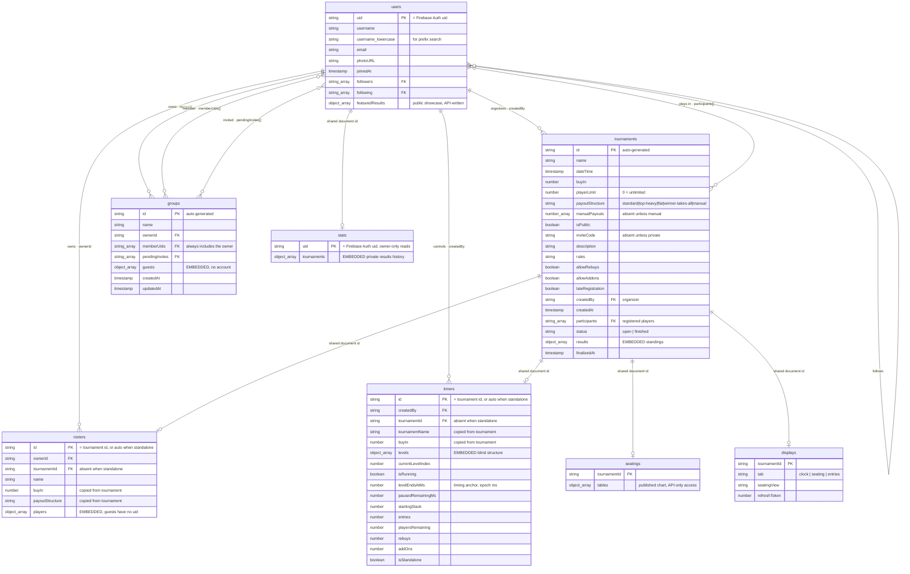

# PokerPal — storage structure

The database is **Cloud Firestore**, a document store. Eight top-level
collections, no subcollections anywhere: related data is either linked by
document id or embedded directly in the parent document.

Field-level semantics live in the [API README](../README.md#data-model); this
document is the structural picture.

## How to read the diagram

Firestore has no foreign keys and no joins, so three conventions stand in for
them:

| Notation | Meaning |
|---|---|
| **PK** | The document id. Not a stored field — it *is* the document's address. |
| **FK** | A field holding another document's id. Nothing enforces it; the application maintains it. |
| `string_array` | An array of document ids — a many-to-many relationship with no join table. |
| `object_array` | **Embedded records.** These have no relational equivalent: they are rows that live inside the parent document and cannot be queried independently. |

Five collections use a **shared document id** instead of a foreign key: a
tournament's roster, clock, published seating and display-control doc are all
stored under the tournament's own id, and a player's private stats doc under
their uid. That makes each one-to-one relationship structural rather than
conventional — it is impossible to create two clocks for one tournament.

## The diagram



## The embedded records

These are the `object_array` fields above, shown as the tables they would be in
a relational model.

**`stats/{uid}.tournaments[]`** — one row per result in a player's private
history. (This lived on `users.tournaments[]` until the user document — readable
by every signed-in user — was found to be leaking buy-in amounts; the API still
falls back to the legacy field on read and clears it on write.)

| Field | Type | Notes |
|---|---|---|
| `id` | string | `"<tournamentId>:<uid>"` when finalized; a timestamp when entered by hand |
| `date` | string | `yyyy-MM-dd` |
| `title` | string | The tournament's name at the time |
| `buyin` | number | Note the lower-case "i" |
| `rebuy` | number | A **money amount**, not a count |
| `win` | number | Winnings |
| `tournamentId` | string | **FK → tournaments.** Present only on finalized rows |
| `place` | number | Finishing position. Present only on finalized rows |

**`tournaments.results[]`** — the standings, written when a tournament closes.

| Field | Type | Notes |
|---|---|---|
| `uid` | string \| null | **FK → users.** Null for a guest |
| `name` | string | Display name at the time |
| `place` | number | 1 is the winner |
| `winnings` | number | |

**`rosters.players[]`** — who is playing, and what they have paid.

| Field | Type | Notes |
|---|---|---|
| `name` | string | |
| `uid` | string \| null | **FK → users.** Null identifies a guest |
| `buyInPaid` | boolean | |
| `rebuys` | number | A **count**, unlike the money amount above |
| `addOns` | number | A count |

**`groups.guests[]`** — `{id, name}`. People with no account.

**`timers.levels[]`** — `{smallBlind, bigBlind, ante, durationMinutes, isBreak, name}`.

## Relationships as plain text

For documentation that cannot render Mermaid:

```
users (id = Firebase Auth uid)
  ├── organizes ─────────► tournaments.createdBy             1 : N
  ├── plays in ──────────► tournaments.participants[]        M : N
  ├── owns ──────────────► rosters.ownerId                   1 : N
  ├── owns ──────────────► groups.ownerId                    1 : N
  ├── member of ─────────► groups.memberUids[]               M : N
  ├── invited to ────────► groups.pendingInvites[]           M : N
  ├── controls ──────────► timers.createdBy                  1 : N
  ├── follows ───────────► users.followers[] / following[]   M : N  (self-referential)
  └── stats/{SAME uid} ──  1 : 1   private results history (owner-only)

tournaments (id, auto)
  ├── rosters/{SAME id} ─────────  1 : 1   payments and guests
  ├── timers/{SAME id} ──────────  1 : 1   live clock
  ├── seatings/{SAME id} ────────  1 : 1   published chart (API-only)
  ├── displays/{SAME id} ────────  1 : 1   TV remote-control doc
  ├── embeds results[] ──────────► users   via results[].uid
  └── referenced by ─────────────► stats.tournaments[].tournamentId

Guests are not users. They exist only as embedded records inside
rosters.players[] (uid absent) and groups.guests[], and are matched
across them by lower-cased name.
```

## Two decisions worth being able to defend

**Why a player's history is one embedded array rather than a collection of
rows.** It is always read as a whole and always scoped to one player, so
embedding costs one document read instead of a query. It lives in its own
owner-only `stats/{uid}` document rather than on the public profile, because
Firestore rules cannot hide a single field of a readable document and the
history is private financial data. The trade-off is real and worth stating: the
array grows without bound against Firestore's 1 MiB document limit, and it
cannot be aggregated across users — "who has won the most?" would require
reading every stats document. At the scale this application targets, a home game
among friends, neither has bitten.

**Why a finished tournament is recorded in two places.** The standings on the
tournament answer "who came where"; the row in each player's history answers
"what did this cost me". They serve different readers, and neither is a subset
of the other. Finalized rows carry `tournamentId` and `place` so the two halves
join properly, and the same fields distinguish a finalized result from one the
player typed in.

Both writes happen inside a **single Firestore transaction**, so a tournament
cannot end up closed with only some players' histories updated.

## Appendix — the same information as a star schema

The example this diagram was modelled on is dimensional: a fact table
surrounded by dimensions. PokerPal's equivalent fact is a **tournament result**,
one row per player per tournament.

> This is a **logical view for comparison only**. It is not how the data is
> stored — the fact rows live embedded in `stats/{uid}.tournaments[]` and
> `tournaments.results[]`, not in a collection of their own.

```
        ┌──────────────┐                 ┌──────────────┐
        │     user     │                 │  tournament  │
        │──────────────│                 │──────────────│
        │ uid      PK  │                 │ id       PK  │
        │ username     │                 │ name         │
        │ email        │                 │ dateTime     │
        └──────┬───────┘                 │ buyIn        │
               │                         │ isPublic     │
               │                         └──────┬───────┘
               │                                │
               │      ┌──────────────────┐      │
               └─────►│      result      │◄─────┘
                      │──────────────────│
                      │ uid          FK  │
                      │ tournamentId FK  │
                      │ place            │
                      │ buyin            │
                      │ rebuy            │
                      │ win              │
                      └──────────────────┘
```
